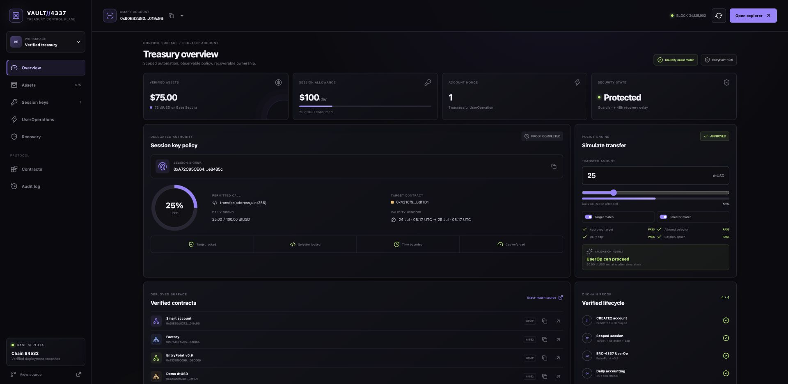
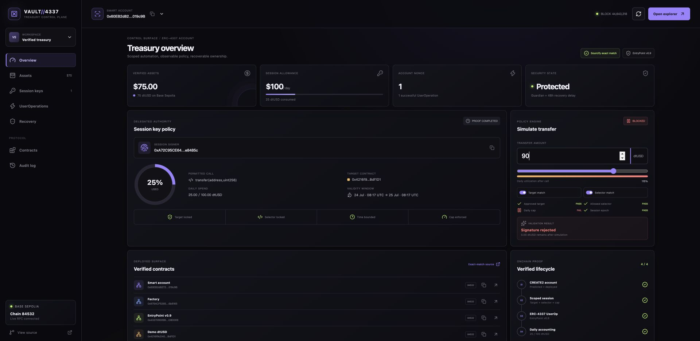
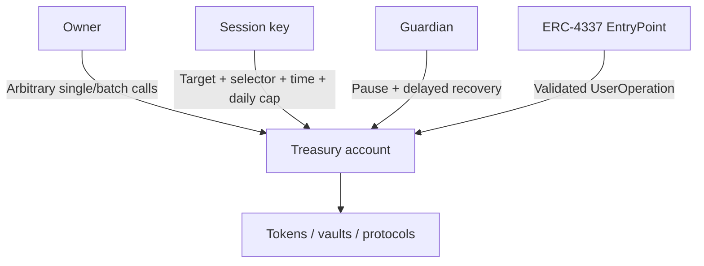

# Treasury Smart Account

An ERC-4337 treasury account with owner execution, constrained session keys,
ERC-1271 signatures, guardian freeze, delayed recovery, and deterministic
CREATE2 deployment. The accompanying React control plane reads the verified
Base Sepolia account and makes its authority boundaries visually inspectable.

The project demonstrates how a bot or employee key can receive narrowly scoped authority without receiving unrestricted control over treasury funds.

> Educational portfolio implementation. The contracts have not been independently audited and must not be used to secure production funds.





## Interactive control plane

The dashboard is a read-only control surface plus a local policy simulator. It
does not request private keys or submit transactions. It shows:

- live owner, guardian, pause state, session epoch, and block number when the
  Base Sepolia RPC is available;
- the exact-match verified contracts and transaction evidence documented in
  [`deployments/base-sepolia.md`](deployments/base-sepolia.md);
- session-key target, selector, validity, epoch, and daily-spend boundaries;
- an interactive allow/deny simulator for target, selector, and spend changes;
- the CREATE2 → session configuration → UserOperation → accounting lifecycle;
  and
- the guardian pause and delayed recovery path.

Run it locally:

```bash
cd dashboard
npm ci
npm run dev
```

See [`docs/control-plane.md`](docs/control-plane.md) for the data model,
security boundaries, and verification commands.

## Permission model



### Owner

- Direct or ERC-4337 execution.
- Single and batch calls.
- Configures/revokes sessions.
- Changes guardian.
- Delayed two-step owner transfer.
- Cancels guardian recovery and unpauses the account.

### Session key

- EOA key only in this MVP.
- Restricted to one target and function selector.
- Restricted by `validAfter` and `validUntil`.
- Native-value sessions account for `msg.value`.
- ERC-20 sessions support exact `transfer(address,uint256)` calls and account for the transfer amount.
- Daily limits are enforced during both UserOperation validation and execution.

### Guardian

- May pause execution immediately.
- While paused, may nominate a recovery owner.
- Recovery completes after two days and increments `sessionEpoch`, invalidating every previously configured session.

## ERC-4337 signature encoding

The account expects the first byte of `userOp.signature` to select a validator:

```text
0x00 || owner signature
0x01 || session-key signature
```

Session-mode `userOp.callData` must call:

```solidity
executeSession(sessionKey, target, value, data)
```

The recovered signer must equal `sessionKey`, and the call must satisfy its stored policy. The account receives an EntryPoint address through its constructor, allowing local testing and explicit production configuration.

## Security properties

- Session execution cannot exceed its same-day limit.
- Session validation cannot authorize a different target or selector.
- Owner changes and guardian recovery invalidate old sessions by epoch.
- Pausing blocks all asset execution.
- Token transfers conserve the account's initially funded balance in invariant tests.
- ERC-1271 reports only current-owner signatures as valid.

See [SPEC.md](SPEC.md) and [THREAT_MODEL.md](THREAT_MODEL.md).

## Development

```bash
forge install --no-git --shallow \
  OpenZeppelin/openzeppelin-contracts@v5.6.1 \
  foundry-rs/forge-std@v1.16.2
forge fmt --check
forge test -vvv
forge lint
```

Validate the control plane separately:

```bash
cd dashboard
npm ci
npm run check
npm run test
npm run build
```

Pinned toolchain:

- Foundry `v1.7.1`
- Solidity `0.8.34`
- OpenZeppelin Contracts `v5.6.1`
- forge-std `v1.16.2`

## Deployment

Set the production ERC-4337 EntryPoint, owner, guardian, and salt in `.env`, then run:

```bash
forge script script/Deploy.s.sol:Deploy --rpc-url "$RPC_URL" --broadcast
```

`TreasurySmartAccountFactory.getAddress` predicts the CREATE2 account address before deployment.

### Base Sepolia ERC-4337 demo

Base Sepolia has the OpenZeppelin-compatible EntryPoint v0.9 at
`0x433709009B8330FDa32311DF1C2AFA402eD8D009`. The demo deploys a deterministic account, proves direct owner
execution, then submits a session-key `PackedUserOperation` through the real EntryPoint to transfer a capped amount
of a test ERC-20:

```bash
export DEMO_DEPLOYER=0xYourDeployer
export ENTRY_POINT=0x433709009B8330FDa32311DF1C2AFA402eD8D009
forge script script/DeployDemo.s.sol:DeployDemo \
  --rpc-url https://sepolia.base.org \
  --account portfolio-testnet \
  --gas-estimate-multiplier 400 \
  --broadcast
```

The session key is deterministically derived and public by design; it is restricted to the one-day demo policy and
must never be reused for real assets.

The deployment command uses a larger broadcast gas-estimate multiplier because EntryPoint `handleOps` enforces
outer-call gas headroom based on the UserOperation gas limits, not only the gas observed during simulation. Unused
transaction gas is not charged.

See the [live Base Sepolia deployment record](deployments/base-sepolia.md) for verified addresses, UserOperation
transactions, and final account state.

## Explicit limitations

- Session keys are EOA/secp256k1 keys; contract session validators are not included.
- ERC-20 session accounting supports standard `transfer(address,uint256)` only.
- No paymaster, aggregator, ERC-7579 module system, or EIP-7702 delegation is included.
- The guardian is trusted not to perform a malicious delayed recovery.
- The EntryPoint address is trusted and immutable for each account.
- This implementation is intentionally non-upgradeable.

## License

MIT
